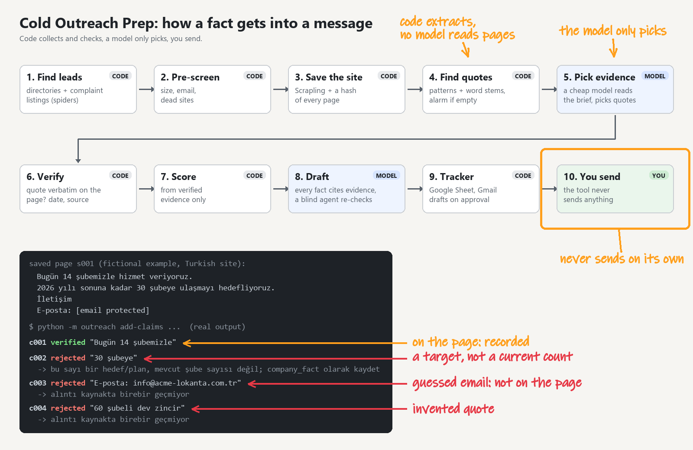

# cold-outreach-prep

A Claude Code skill for evidence-first B2B prospecting. It finds companies that show a buying
signal for your product, researches them and the right decision maker, scores them, and drafts a
personalised first message. **Every fact in a message is backed by a verbatim quote from a saved
source, checked by code and then by an independent agent. It never sends anything.**

<p align="center">
  
</p>

The terminal shows real verifier output on a fictional Turkish page. The error messages are the
tool's own (in Turkish); the handwritten labels translate them.

## Why evidence-first

One wrong fact in a cold message (an old price, the wrong company, an invented statistic) ends
the conversation. LLM research fails in predictable ways: JS-rendered pages return an empty shell
with `200 OK` and the model fills the gap from memory; search snippets are stale; nuance like
"from CHF 349" becomes "CHF 349". This project treats those as engineering problems:

| Failure | Guard |
|---|---|
| Empty JS page treated as success | Fetch chain `http → real browser`, escalates on thin text or missing expected terms |
| Site blocks automated clients | CAPTCHA / challenge pages and 403/429 are recorded as unreachable; no stealth or anti-detection mode is used |
| Fact filled from memory/snippet | A claim needs a verbatim quote found in a saved snapshot (checked by code, whitespace/case/Turkish-İ aware) |
| Snapshot edited after the fact | SHA-256 of every snapshot is checked |
| Stale information | Per-type age limits; dates must be proven by a date quote or page metadata |
| Invented numbers | Every number in a claim or message must appear in a cited quote |
| Guessed email addresses | Recipients must come from an address the company publishes |
| Wrong citation / misleading use | Blind verifier agent re-reads the sources and passes or fails each draft |
| Review then edit | A review is bound to a hash of the exact draft; any change invalidates it |

Unknown stays empty. A lead with no verified decision maker is exported with that cell blank.

## How it works

```
product pack ─┐
              ├─ 1. discovery: discovery spider over the market's listing pages + web search → candidates
              ├─ 2. research: site spider maps each lead (sitemap/links) → snapshots → quote-backed claims
              ├─ 3. score: fit · signal · timing · reach, from verified claims only
              ├─ 4. draft: every fact cites [cNNN] lead evidence or [kNNN] product knowledge
              ├─ 5. verify: code checks + blind verifier agent
              └─ 6. export: Google Sheet (or CSV) + review files with sources + Gmail drafts on request
```

Scrapling spiders do the legwork: `discover` walks listing pages declared in the market catalog (e.g.
complaint-site categories) and groups dated items by company; `crawl` maps a lead's own site from its
sitemap (or internal links), picks the evidence-bearing pages and renders JS pages in a real browser.
Both obey robots.txt, throttle per domain and never retry or evade a block.

A **market catalog** (`markets/<country>.toml`) holds what differs by country: which review sites,
job boards and registries may be used (robots.txt and terms of use checked, with dates and reasons),
which are excluded for every method, local news domains to focus the US-centric web search on, and
query tips for the local language. `markets/tr.toml` covers Türkiye.

A **product pack** (`products/<slug>/`) holds everything product-specific: `profile.toml`
(segments, decision-maker titles, signal search patterns, exclusions, scoring, message rules), your
own docs, and a verified knowledge base that drafts retrieve from (BM25, no external services).
`products/demo-bakeplan/` is a fictional example. Real packs and all research runs are git-ignored.

## Setup

```bash
pip install -e ".[dev]"
scrapling install        # browser dependencies
python -m outreach doctor
python -m pytest
```

Having Google Chrome installed is recommended: the browser steps use it, which is the most reliable
option against bot protection. Google Drive and Gmail connectors in Claude are optional; without
them you get `sheet.csv` and plain-text drafts.

## Usage

Open the folder in Claude Code and ask, for example:

- "Yeni ürün paketi kuralım" / "set up a product pack for my product"
- "demo-bakeplan için müşteri adayı bul"
- "cevap gelen var mı?" (read-only reply check)

The skill lives in `.claude/skills/cold-outreach-prep/`, the verifier in
`.claude/agents/outreach-verifier.md`, the tooling in `outreach/` (`python -m outreach --help`).

## Limits and responsibilities

- It respects `robots.txt` and rate-limits per domain; disallowed pages (e.g. Google Maps) are
  skipped, not worked around. For a few shortlisted leads you can paste such text yourself (or have
  Claude read one page in your own browser); it is stored as a labelled user-supplied source and can
  never back official facts like prices or contacts. Domains whose terms forbid commercial use are
  listed under `[sources].excluded` in the pack and rejected for every method. It does not scrape
  LinkedIn or log in anywhere.
- It collects only professional information (name, title, public work statements, published
  business contact). You are responsible for how you contact people (KVKK, GDPR, anti-spam rules).
- The Google Drive connector cannot edit an existing sheet, so each export is a new sheet version;
  your status/notes columns are carried over from the latest version.
- Code checks prove a quote exists; they cannot prove it is interpreted correctly. That is what the
  verifier agent and your own final read are for.

## License

MIT, see [LICENSE](LICENSE).
